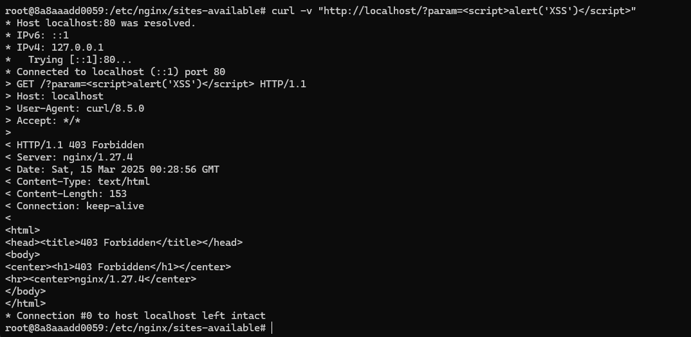

# Enhanced Nginx Build with Lua Support, ModSecurity WAF, and Security Modules


1. [News](#news)
2. [Screenshots](#screenshots)
3. [Test Cases](#test-cases)
    -   [Lua Test Cases](#lua-test-cases)
        1. [Basic Authentication Test](#1-basic-authentication-test)
        2. [Security Filter Test](#2-security-filter-test)
        3. [Lua Module Test](#3-lua-module-test)
    - [ModSecurity Test Cases](#modsecurity-test-cases)
        1. [SQL Injection Test](#1-sqli)
        2. [XSS Attack Test](#2-xss-attack-test)
    - [Test Cases for nginx-ultimate-bad-bot-blocker](#nginx-ultimate-bad-bot-blocker-test-cases)
4. [Introduction](#introduction)
5. [Features](#features)
6. [Prerequisites](#prerequisites)
7. [Recommended SSL Configuration](#recommended-ssl-configuration)
8. [Recommended Lua Extensions](#recommended-lua-extensions)


# News

* Now you can try it without installing anything. Pre-built docker image released.

```
docker run --rm -d --name test-nginx -p 5002:80 derank123/lua-ubuntu-nginx-modsec-bot-blocker:1.27.4
```
- Change port, as it is set to 5002 for host
- For port 80 -> ```docker run -d -p 80:80```

Some tests:


# Screenshots


* Possibility to build for custom nginx version
* Test-cases included

* Optional modules you can install (it will be updated in the future): 
     * nginx-ultimate-bad-bot-blocker 

# Lua test-cases


### 1. Basic Authentication Test

Code:
```lua
location /admin {
    content_by_lua_block {
        -- Get AUTH header
        local auth = ngx.var.http_authorization
        
        -- Verify credentials format and match
        local expected_auth = "Basic " .. ngx.encode_base64("admin:password")
        
        if not auth or auth ~= expected_auth then
            -- Send authentication challenge
            ngx.header["WWW-Authenticate"] = 'Basic realm="Restricted Area"'
            ngx.exit(ngx.HTTP_UNAUTHORIZED)
        end
        
        -- Grant access
        ngx.say("Access granted!")
    }
}
```


#### 1. Without credentials (should fail)
```curl -v http://localhost/admin```


<b>Expected: 401</b>

#### 2. With valid credentials (admin:password)
```curl -v -H "Authorization: Basic $(echo -n 'admin:password' | base64)" http://localhost/admin```


<b>Expected: 200 OK with "Access granted!"</b>


---

### 2. Security Filter Test 


Code:
```lua
location /lua_security_test {
    content_by_lua_block {
        -- Define malicious patterns to block
        local bad_patterns = {
            "script",   -- Blocks HTML script tags
            "SELECT",   -- Blocks SQL SELECT statements
            "UNION"     -- Blocks SQL UNION operators
        }

        -- Get query parameters
        local query = ngx.var.query_string or ""
        
        -- Check each pattern in the query
        for _, pattern in ipairs(bad_patterns) do
            -- plain=true: disable pattern matching
            -- start=1: search from first character
            if string.find(query, pattern, 1, true) then
                ngx.exit(ngx.HTTP_FORBIDDEN)
            end
        end

        -- If no bad patterns found
        ngx.say("Query is safe!")
    }
}
```

#### 1. Safe query
```curl -v "http://localhost/lua_security_test?q=safe_query"```


<b>Expected: 200 OK</b>

#### 2. Malicious query
```curl -v "http://localhost/lua_security_test?input=<script>alert(1)</script>"```


<b>Expected: 403 Forbidden</b>

-----

### 3. Lua Module Test

Code:
```lua
location /say_hello_lua {
    content_by_lua_block {
        -- Simple greeting endpoint to verify Lua integration
        ngx.say("Hello from lua-nginx-module!")
        
        -- Optional: Add response headers
        ngx.header["Content-Type"] = "text/plain"
        ngx.header["X-Lua-Powered"] = "true"
    }
}
```

```curl -v http://localhost/say_hello_lua```


# ModSecurity test-cases

#### 1. SQLi

```curl -v "http://localhost/?id=1%27%20OR%201=1--"```


Log:


<b>Expected: 403 Forbidden (ModSecurity blocking SQLi)</b>

#### 2. XSS Attack Test

```curl -v "http://localhost/?param=<script>alert('XSS')</script>"```




Log:


<b>Expected: 403 Forbidden</b>

# nginx-ultimate-bad-bot-blocker test-cases


```curl -A "Xenu Link Sleuth" -I http://localhost```


<b>Expected: Empty reply from server</b>

## Introduction

A hardened Nginx build with integrated security features including Lua scripting, ModSecurity WAF, OWASP Core Rule Set, and advanced bot protection.

## Features

- **Nginx 1.27.4** with custom-compiled modules
- **LuaJIT 2.1** scripting support
- **ModSecurity 3.0** Web Application Firewall
- **OWASP Core Rule Set** protection
- **Nginx Ultimate Bad Bot Blocker**
- **GeoIP2** support
- **Lua RESTy** components:
  - lua-resty-core
  - lua-resty-lrucache
  - lua-resty-redis
  - lua-resty-mysql
  - And more...
- Stream and HTTP Lua modules
- Enhanced security headers
- Thread support and modern protocol support

## Prerequisites

- Ubuntu 24.04 (or compatible Debian-based system)
- Root/sudo access
- 2GB+ RAM (4GB recommended for compilation)
- 5GB+ disk space

## Recommended SSL Configuration

```bash
ssl_protocols TLSv1.2 TLSv1.3;
ssl_prefer_server_ciphers on;
ssl_ciphers EECDH+AESGCM:EDH+AESGCM;
ssl_ecdh_curve secp384r1;
ssl_session_timeout 10m;
ssl_session_cache shared:SSL:10m;
```

## Recommended Lua Extensions

```bash
sudo luarocks install lua-resty-jwt
sudo luarocks install lua-resty-http
```

## Test 

```bash
location /lua-test {
    content_by_lua_block {
        ngx.say("Hello from Lua!")
        ngx.log(ngx.ERR, "Custom Lua logging")
    }
}
```


## Install 

Ubuntu supported as of now only (other distros will be supported soon)
* Clone the repo
* Make sh executable
* Run it with sudo

